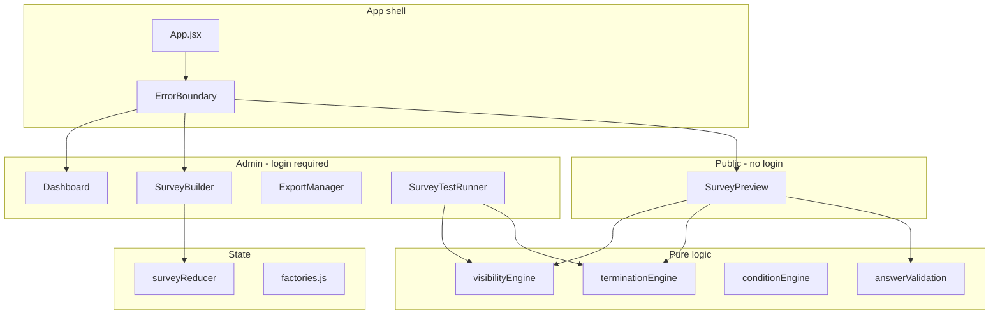

# SurveyForge

A browser-based survey authoring and delivery platform for market research and CX teams. Build complex questionnaires with logic, preview them as respondents would see them, collect responses locally, and export data to CSV — all without a backend server.

---

## Purpose

SurveyForge helps researchers and survey programmers:

- **Design** multi-page surveys with 19 question types, groups, page breaks, and rich text blocks
- **Control flow** with conditional visibility, screen-out rules, and multi-condition termination blocks
- **Validate** survey paths before fielding via an built-in test runner
- **Distribute** surveys through shareable URLs (`#/take/SURVEY_ID`)
- **Export** response data and column templates for analysis pipelines

Everything runs in the browser. Surveys, responses, and admin settings persist in **localStorage**, making the app suitable for local development, demos, and self-hosted white-label deployments.

---

## Target audience

| Audience | How they use SurveyForge |
|----------|--------------------------|
| **Market researchers & survey designers** | Author questionnaires, configure logic, preview respondent experience |
| **Fieldwork / operations teams** | Manage survey library, set live/closed status, export responses |
| **Developers extending the platform** | Add question types, wire new logic, integrate via documented module APIs |
| **Respondents** | Complete surveys via public links (no login required) |

SurveyForge is **not** a hosted SaaS product out of the box — it is a self-contained SPA intended for teams who control their own deployment and data storage.

---

## Features

### Builder

- Drag-and-drop survey structure (questions, page breaks, groups, text/media blocks)
- 19 question types across choice, text, grid, scale, and advanced categories
- Per-question editors with type-specific configuration
- Answer piping into question text and dynamic option lists
- Conditional visibility (show if / hide if) on questions and structural items
- Instant screen-out options, per-question termination rules, and termination blocks
- Cover page, branding (logo), and customizable screen-out / closed messages
- Survey metadata (client, topic, survey code, status: draft / live / paused / closed)
- Do-not-contact (DNC) list and email capture field
- Optional digital fingerprinting on responses
- JSON export of full survey definition

### Taker / preview

- Paginated survey flow with validation
- Live preview from builder and standalone public taking route
- Closed-survey and termination screens
- Response storage and CSV download on completion

### Admin

- Dashboard with search, filters, and response counts
- Platform settings (clients, topics, users)
- Export manager for bulk response CSV
- Test runner — simulates branches (completion, screen-outs, visibility paths)

---

## Question types

| Group | Types |
|-------|-------|
| **Choice** | Single select, multi select, dropdown, cascading dropdown, image choice (single/multi) |
| **Text** | Open text, textbox list |
| **Input** | Date |
| **Grid** | Matrix grid, bipolar matrix |
| **Scale** | NPS, star rating, semantic differential, slider |
| **Advanced** | MaxDiff, card sort, constant sum, ranking |

---

## Tech stack

| Layer | Technology |
|-------|------------|
| UI | React 18 |
| Build | Vite 5 |
| Styling | Tailwind CSS 3 |
| Drag & drop | @dnd-kit |
| Icons | Lucide React |
| State | React `useReducer` + custom store |
| Persistence | Browser `localStorage` |

---

## Architecture

The codebase separates **authoring** (builder), **delivery** (taker), and **pure logic** (utils engines). Question types use a **registry pattern**: one canonical list drives parallel builder and taker registries.



### Directory layout

```
src/
├── App.jsx                 Routing, auth gate, public #/take/ route
├── components/
│   ├── auth/               Login
│   ├── dashboard/          Survey library + platform settings
│   ├── builder/            SurveyBuilder, editors, items, panels, test-runner
│   ├── taker/              SurveyPreview, question renderers, screens
│   ├── shared/             Reusable editors, ConditionBuilder, ErrorBoundary
│   └── ui/                 Toggle, badges, layout primitives
├── store/                  ID, factories, initialState, surveyReducer
└── utils/                  Engines, CSV, piping, persistence helpers

docs/
├── PUBLIC_API.md           Module reference for contributors
└── SMOKE_CHECKLIST.md      Manual QA checklist

scripts/
└── check-registries.js     Builder/taker registry parity check
```

### Design principles

1. **Single source of truth** — `questionHelpers.js` defines types; builder and taker registries must stay in sync
2. **Pure logic in utils** — visibility, termination, and conditions are evaluated outside React components
3. **Shared UI for repeated patterns** — condition lists, editable list rows, deletable inputs
4. **Registry verification** — `npm run check:registries` catches missing question type handlers after refactors

For module-level detail, see [docs/PUBLIC_API.md](docs/PUBLIC_API.md).

---

## Getting started

### Prerequisites

- **Node.js** 18+ (20+ recommended)
- **npm** 9+

### Install

```bash
git clone <repository-url>
cd survey-builder
npm install
```

### Development

```bash
npm run dev
```

Open the URL shown in the terminal (typically `http://localhost:5173`).

**Default admin login** (first run):

| Username | Password |
|----------|----------|
| `admin` | `admin123` |

Change credentials under **Dashboard → Settings → Users** after first login.

### Other scripts

| Command | Description |
|---------|-------------|
| `npm run dev` | Start Vite dev server with HMR |
| `npm run build` | Production build to `dist/` |
| `npm run preview` | Serve production build locally |
| `npm run check:registries` | Verify question type registry parity |

---

## Usage

### 1. Create a survey

1. Log in → **New Survey**
2. Add questions from the right sidebar
3. Configure logic (visibility, termination) as needed
4. Set status to **Live** when ready to collect responses

Surveys auto-save to localStorage on every change.

### 2. Share with respondents

When a survey has an ID, the builder shows a shareable URL:

```
https://your-host/#/take/SURVEY_ID
```

Respondents do not need an account. If status is **Closed**, they see the closed-survey page.

### 3. Preview & test

- **Preview** — walk through the survey as a respondent from the builder header
- **Test** — open the Test Runner to simulate completion and screen-out branches

### 4. Export data

- **CSV Template** — download column headers + sample row for data pipeline setup
- **Exports** — open Export Manager for response CSV (includes fingerprint columns when enabled)
- **Save JSON** — full survey definition backup

---

## Data & storage

All data is stored in the browser **localStorage**:

| Key area | Module |
|----------|--------|
| Survey definitions | `surveyLibrary.js` |
| Responses | `responseStore.js` |
| Admin users / session | `authStore.js` |
| DNC list | `dncStore.js` |
| Platform clients/topics | `platformStore.js` |

**Implications:**

- Data is per-browser, per-origin — clearing site data removes surveys and responses
- No multi-user sync or server backup unless you add a backend
- Suitable for local/dev/demo; production deployments should plan export backup or custom persistence

---

## Security note

Authentication is **lightweight access control** for self-hosted team use (plain-text passwords in localStorage). It is **not** suitable for protecting sensitive data on the public internet without additional hardening (HTTPS, real auth backend, etc.).

---

## Development guide

### Verify after changes

```bash
npm run check:registries
npm run dev
```

Run through [docs/SMOKE_CHECKLIST.md](docs/SMOKE_CHECKLIST.md) when touching builder, taker, visibility, termination, or export logic.

### Adding a new question type

See the checklist in [docs/PUBLIC_API.md](docs/PUBLIC_API.md#adding-a-new-question-type):

1. Register in `questionHelpers.js`
2. Add factory defaults in `store/factories.js`
3. Create builder editor + taker renderer
4. Wire validation and CSV formatting
5. Run `npm run check:registries`

### Path alias

Imports use `@/` → `src/` (configured in `vite.config.js`).

---

## Documentation

| Document | Contents |
|----------|----------|
| [docs/PUBLIC_API.md](docs/PUBLIC_API.md) | Module exports, store actions, engine reference |
| [docs/SMOKE_CHECKLIST.md](docs/SMOKE_CHECKLIST.md) | Manual QA checklist |

---

## Limitations & roadmap considerations

- No server-side API or database — localStorage only
- No multi-language / localization UI
- No real-time collaboration on survey design
- Auth is basic local user list, not enterprise SSO

These are intentional for a self-contained SPA; extend via backend integration as needed.

---

## License

Private project (`"private": true` in `package.json`). Contact the repository owner for licensing terms.
