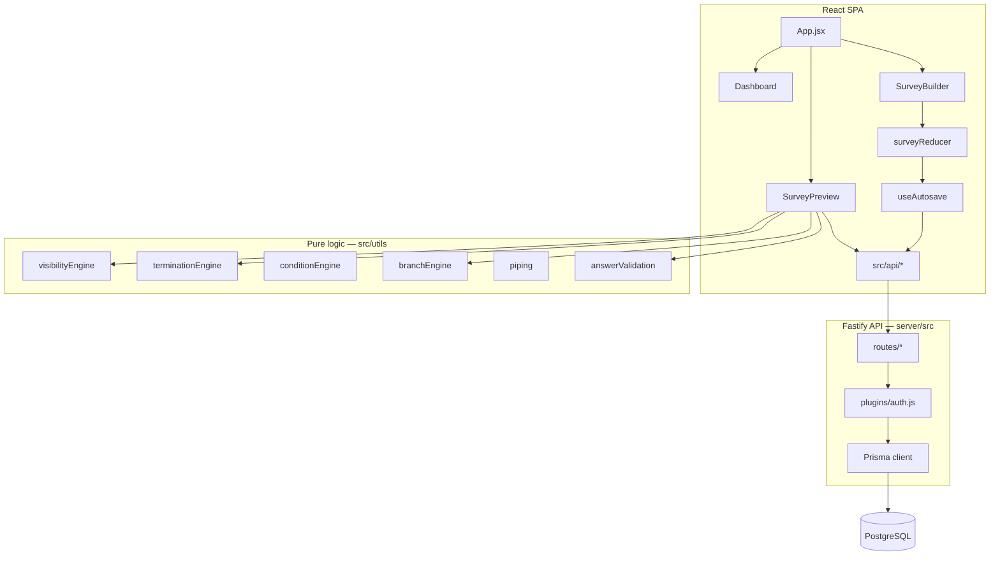

# SurveyForge

Browser-based survey authoring and delivery platform for market research and CX teams. React SPA with an optional Fastify/Prisma/PostgreSQL backend — same codebase supports **offline localStorage mode** and **multi-tenant API mode**.

---

## Tech stack

| Layer | Technology |
|-------|------------|
| **Frontend** | React 18, Vite 5, Tailwind CSS 3, @dnd-kit, Lucide React |
| **State** | React `useReducer` + `surveyReducer`; debounced autosave hook |
| **Backend** | Fastify 5, @fastify/jwt, @fastify/cors, bcrypt |
| **Database** | PostgreSQL 16, Prisma 6 |
| **Deploy** | Docker Compose (nginx + API + Postgres), multi-stage Dockerfiles |
| **Tests** | Node.js built-in test runner (`node --test`) |

---

## Runtime modes

Controlled by `VITE_USE_API` at build time (`src/config/api.js`):

| Mode | `VITE_USE_API` | Persistence | Auth |
|------|----------------|-------------|------|
| **Local** (default dev) | unset / `false` | Browser `localStorage` | Plain-text credentials in `localStorage` |
| **API** (production) | `true` | PostgreSQL via Fastify | JWT in `sessionStorage` (`POST /api/auth/login`) |

Both modes share the same React UI, logic engines, and question type registries. Store modules (`authStore`, `surveyLibrary`, `responseStore`, `dncStore`, `platformStore`) branch internally on `useApi`.

Vite dev server proxies `/api` → `http://127.0.0.1:3003` (`vite.config.js`). Docker nginx does the same in production (`docker/nginx.conf`).

---

## Architecture

The codebase separates **authoring** (builder), **delivery** (taker), **pure logic** (utils engines), and **persistence** (localStorage or API layer). Question types use a **registry pattern**: one canonical list in `questionHelpers.js` drives parallel builder editor and taker renderer registries.



### Design principles

1. **Single source of truth** — `questionHelpers.js` defines question types; builder and taker registries must stay in sync (`npm run check:registries`).
2. **Pure logic in utils** — visibility, termination, conditions, branching, and piping are evaluated outside React components.
3. **Shared condition model** — `conditionEngine` powers visibility rules, termination blocks, branch rules, and external redirects.
4. **Live role enforcement** — JWT is verified per request, then the user's role is re-read from the database (not trusted from the token snapshot).
5. **Optimistic concurrency** — survey PATCH uses a monotonic `revision` counter; autosave serializes writes to avoid conflicts.
6. **Dual-mode stores** — persistence helpers abstract localStorage vs API so UI code stays mode-agnostic.

---

## Repository layout

```
survey-builder/
├── src/                    React SPA
│   ├── App.jsx             Routing, auth gate, lazy-loaded views
│   ├── api/                Thin fetch wrappers per domain (surveys, responses, dnc, billing, …)
│   ├── components/
│   │   ├── auth/           Login
│   │   ├── dashboard/      Survey library, platform settings, billing, team
│   │   ├── builder/        SurveyBuilder, editors, items, panels, test-runner
│   │   ├── taker/          SurveyPreview, question renderers, screens
│   │   ├── shared/         ConditionBuilder, RichTextEditor, NavigationLockEditor, …
│   │   └── ui/             Primitives (Modal, Toast, loaders)
│   ├── config/             Feature flags (`api.js`)
│   ├── constants/          Survey defaults, navigation lock, auth copy
│   ├── hooks/              useAutosave, usePageNavigationLock
│   ├── store/              ID generator, factories, initialState, surveyReducer
│   └── utils/              Engines, CSV export, persistence helpers
├── server/
│   ├── src/
│   │   ├── app.js          Fastify bootstrap, route registration
│   │   ├── plugins/        Prisma, JWT auth hook
│   │   ├── routes/         REST handlers (auth, surveys, public, dashboard, …)
│   │   └── lib/            Authz, seed, billing, survey public paths, normalization
│   └── prisma/             Schema and migrations
├── shared/                 Cross-package utilities (surveyUrl, matrixAnswer)
├── scripts/                Registry check + phase tests (logic + API integration)
├── docker/                 nginx config for production web container
├── docs/                   Module reference, smoke checklist
├── docker-compose.yml      Full stack (Postgres + API + web)
├── Dockerfile              Production web image (VITE_USE_API=true)
└── vite.config.js          Aliases (@/, @shared/), API proxy, code splitting
```

### Path aliases

| Alias | Resolves to |
|-------|-------------|
| `@/` | `src/` |
| `@shared/` | `shared/` |

---

## Frontend implementation

### Routing

Hash-based SPA routing (`src/utils/appRoute.js`):

| Route | View | Auth |
|-------|------|------|
| `#/` | Dashboard | Required |
| `#/builder/:id` | Survey builder | Required |
| `#/preview/:id` | Internal preview | Required |
| `#/take/:id` | Public taker | None |

**White-label path URLs** also resolve on `surveys.{clientDomain}/{publicPath}` (no hash). Client domain is parsed from the hostname; the path slug maps to `survey.publicPath` in the database.

Views are lazy-loaded with route prefetching (`src/utils/routePrefetch.js`) to reduce initial bundle size. Question type components are loaded on demand via dynamic import registries.

### Builder state

- **Reducer:** `surveyReducer` handles all builder mutations (add/update/delete/reorder items, visibility, termination, settings).
- **Factories:** `store/factories.js` provides default shapes for questions, options, matrix rows/cols, groups, page breaks, etc.
- **Autosave:** `useAutosave` debounces saves (400 ms default), diffs survey/items via JSON snapshot comparison, and serializes API PATCH requests through a promise chain to prevent revision conflicts.

### Logic engines

| Module | Responsibility |
|--------|----------------|
| `visibilityEngine` | Builds respondent-facing page structure; resolves group/page-break/question visibility; computes per-page navigation lock seconds |
| `conditionEngine` | AND/OR condition set evaluation against responses |
| `terminationEngine` | Per-question screen-out rules and multi-condition termination blocks |
| `branchEngine` | Skip-to-page rules on Next click (forward jumps only) |
| `externalRedirectEngine` | Instant or page-level external URL redirects on rule match |
| `piping` | Substitutes answer tokens into question text and dynamic option lists |
| `answerValidation` | Required-field and format validation before page advance |

All engines receive the flat `items` array and current `responses` object. `buildVisiblePages()` must rerun whenever responses change because visibility can depend on prior answers.

### Question type registry

Canonical types live in `src/utils/questionHelpers.js`. Each type requires:

1. Factory defaults in `store/factories.js`
2. Builder editor in `components/builder/editors/` (registry in `editors/index.js`)
3. Taker renderer in `components/taker/questions/` (registry in `questions/index.js`)
4. Validation rules and CSV column formatting

Run `npm run check:registries` after adding or renaming types.

### Respondent flow (`SurveyPreview`)

1. Optional cover page → paginated questions with validation
2. `buildVisiblePages()` drives page structure, termination block placement, and navigation locks
3. On Next: branch rules, external redirects, termination checks, then page advance
4. On complete/terminate: DNC email check, response persistence, optional CSV download
5. Optional device fingerprinting (`deviceSignals.js`) attached to response payload

**Navigation lock** — configurable minimum seconds before Next is enabled, at survey level (page 1 or all pages), page break level, or group level (`constants/navigationLock.js`, `hooks/usePageNavigationLock.js`).

---

## Backend implementation

### Application bootstrap

`server/src/index.js`:

1. Loads config from environment
2. Builds Fastify app (`server/src/app.js`)
3. Seeds default org admin and platform owner (idempotent — `server/src/lib/seed.js`)
4. Runs one-time platform list migration (`migratePlatformLists`)
5. Listens on `PORT` (default 3003)

### Authentication

Global JWT hook on all `/api/*` routes except:

- `POST /api/auth/login`, `POST /api/auth/signup`
- `/api/public/*` (public taker endpoints)

After JWT verification, the handler loads the user from Postgres and attaches `request.auth` with the **live DB role**. Role or org changes take effect on the next request.

| Role | Scope |
|------|-------|
| `admin` | Full org access — all surveys, users, platform settings, billing |
| `editor` | Own surveys only (`createdById` filter via `surveyScope()`) |
| `platform_owner` | Cross-org vendor console — subscriptions, invoices, support threads |

### Survey persistence

Survey definitions are stored as JSONB:

- `survey` — metadata (title, status, settings, branding, client/topic IDs, publicPath, …)
- `items` — flat array of questions, page breaks, groups, text blocks, termination blocks
- `revision` — incremented on every PATCH; client sends expected revision for conflict detection

Public path assignment (`server/src/lib/surveyPublicPath.js`) generates globally unique slugs from internal name + date suffix. Paths lock while a survey is live.

### Response persistence

Responses are upserted by client-provided ID into the `responses` table:

- `status`: `complete` | `terminated` | `partial` | `dnc`
- `payload` JSONB: `{ responses, companions, terminatedBy, fingerprint, pageReached, answerSchemaVersion }`
- Matrix answers normalized server-side via `shared/matrixAnswer.js`

Public writes go through `POST /api/public/surveys/:id/responses` (no auth, live surveys only).

### API surface

| Prefix | Auth | Purpose |
|--------|------|---------|
| `/api/auth/*` | Mixed | Signup, login, session info |
| `/api/dashboard` | JWT | Survey library list with stats |
| `/api/surveys/:id` | JWT | CRUD survey definition |
| `/api/surveys/:id/responses` | JWT | Response list, stats, upsert, delete |
| `/api/surveys/:id/dnc` | JWT | DNC list management |
| `/api/platform/*` | JWT (+ admin for writes) | Clients, topics, users |
| `/api/billing/*` | JWT (admin) | Subscription, invoices, support |
| `/api/vendor/*` | JWT (platform_owner) | Cross-org vendor console |
| `/api/admin/*` | JWT (admin) | Employee stats |
| `/api/public/*` | None | Live survey fetch, DNC list, response submit |
| `/api/migrate/local` | JWT (dev only) | Import localStorage library into Postgres |

See [docs/PUBLIC_API.md](docs/PUBLIC_API.md) for frontend module-level detail.

---

## Database schema

PostgreSQL via Prisma (`server/prisma/schema.prisma`). Multi-organization SaaS model:

| Model | Purpose |
|-------|---------|
| `Organization` | Tenant boundary |
| `User` | Org member with role (`admin`, `editor`, `platform_owner`) |
| `Survey` | JSONB definition + items, revision, publicPath |
| `Response` | JSONB payload per respondent session |
| `Client`, `Topic` | Platform metadata lists per org |
| `DncEntry` | Per-survey do-not-contact emails |
| `Subscription`, `Invoice`, `SupportThread` | Billing and vendor support |

Indexes on `organizationId`, `surveyId`, and common query patterns (dashboard list, response stats).

---

## Shared code

`shared/` is imported by both frontend (`@shared/`) and backend (relative path):

| Module | Purpose |
|--------|---------|
| `surveyUrl.js` | Public path slug generation, white-label URL building, hostname parsing |
| `matrixAnswer.js` | Matrix answer shape normalization (`{ [rowId]: columnId \| columnId[] }`) |

Keeping URL and answer logic shared prevents client/server drift.

---

## Data storage by mode

### Local mode (`localStorage`)

| Key area | Module |
|----------|--------|
| Survey definitions | `surveyLibrary.js` |
| Responses | `responseStore.js` |
| Admin users / session | `authStore.js` |
| DNC list | `dncStore.js` |
| Platform clients/topics | `platformStore.js` |

Data is per-browser, per-origin. Clearing site data removes everything.

### API mode (PostgreSQL)

| Key area | Module / endpoint |
|----------|-------------------|
| Surveys | `api/surveys.js` → `PATCH /api/surveys/:id` |
| Responses | `api/responses.js` → `/api/surveys/:id/responses` |
| Auth | `authStore.js` → JWT + `sessionStorage` session |
| DNC | `dncStore.js` → `/api/surveys/:id/dnc` (in-memory cache on client) |
| Platform lists | `api/platform.js` → `/api/platform/clients`, `/topics` |

---

## Getting started

### Prerequisites

- **Node.js** 20+ (required for server)
- **npm** 9+
- **Docker** (optional — for Postgres and full-stack deploy)

### Install

```bash
git clone <repository-url>
cd survey-builder
npm install
npm install --prefix server
```

### Option A — Local mode (no backend)

```bash
npm run dev
```

Open `http://localhost:5173`. Default admin: `admin` / `admin123`.

### Option B — API mode (local dev)

```bash
# Start Postgres only
docker compose up postgres -d

# Copy and configure env
cp .env.example .env
# Set DATABASE_URL, JWT_SECRET; uncomment VITE_USE_API=true

# Run migrations, then both servers
npm run db:migrate:dev --prefix server
npm run dev:docker
```

Vite on `:5173`, API on `:3003`, Postgres on `:5433`.

On first API start, the server seeds:

| Account | Default credentials | Role |
|---------|---------------------|------|
| Org admin | `admin` / `admin123` | `admin` |
| Platform owner | `vendor` / `vendor123` | `platform_owner` |

Override platform owner via `PLATFORM_OWNER_USERNAME`, `PLATFORM_OWNER_EMAIL`, `PLATFORM_OWNER_PASSWORD`. **Change all defaults before any production deploy.**

### Option C — Docker full stack

```bash
# Pull pre-built images
docker compose pull && docker compose up -d

# Or build locally
docker compose up --build -d
```

App UI: `http://localhost:8080` (override with `WEB_HOST_PORT`).

Set `JWT_SECRET` in the environment — do not use the Compose default in production.

---

## Environment variables

| Variable | Default | Purpose |
|----------|---------|---------|
| `DATABASE_URL` | — | PostgreSQL connection string |
| `PORT` | `3003` | API listen port |
| `NODE_ENV` | `development` | Enables dev-only routes (migrate), CORS |
| `JWT_SECRET` | `dev-secret-change-me` | JWT signing key — **must override in production** |
| `JWT_EXPIRES_IN` | `7d` | Token lifetime |
| `VITE_USE_API` | unset | Build-time flag: enable API persistence |
| `PLATFORM_OWNER_*` | see seed.js | Platform owner bootstrap credentials |
| `WEB_HOST_PORT` | `8080` | Docker web container host port |
| `POSTGRES_HOST_PORT` | `5433` | Docker Postgres host port |

See [.env.example](.env.example) for a starter template.

---

## Scripts

| Command | Description |
|---------|-------------|
| `npm run dev` | Vite dev server |
| `npm run dev:server` | Fastify API with watch |
| `npm run dev:all` | Vite + API concurrently |
| `npm run dev:docker` | Postgres + API mode dev |
| `npm run build` | Production frontend build |
| `npm run check:registries` | Verify builder/taker registry parity |
| `npm run db:migrate` | Apply Prisma migrations (production) |
| `npm run db:migrate:dev` | Create/apply migrations (development) |
| `test:phase2`–`test:phase4` | Frontend logic unit tests |
| `test:rbac1`–`test:rbac6` | API integration tests (requires running server + Postgres) |
| `test:track-a` | All frontend phase tests |

API integration tests expect a live server at `http://127.0.0.1:3003` with a migrated database.

---

## Testing

- **Frontend logic tests** — pure engine tests in `scripts/phase*.test.mjs` (visibility, conditions, piping, matrix, CSV, URLs). No browser required.
- **API integration tests** — `scripts/phase-r*.test.mjs` hit real HTTP endpoints for auth, RBAC, ownership, permissions, employees, billing.
- **Registry check** — `scripts/check-registries.js` ensures every question type has matching builder and taker handlers.
- **Manual QA** — [docs/SMOKE_CHECKLIST.md](docs/SMOKE_CHECKLIST.md).

There is no E2E browser test suite or coverage reporting yet.

---

## Development guide

### Verify after changes

```bash
npm run check:registries
npm run dev          # or dev:docker for API mode
```

Run through [docs/SMOKE_CHECKLIST.md](docs/SMOKE_CHECKLIST.md) when touching builder, taker, visibility, termination, or export logic.

For API/RBAC changes, run the relevant `test:rbac*` scripts against a live server.

### Adding a new question type

1. Register in `questionHelpers.js`
2. Add factory defaults in `store/factories.js`
3. Create builder editor + taker renderer; wire into both registries
4. Add validation in `answerValidation.js` and CSV formatting
5. Run `npm run check:registries`

Full checklist: [docs/PUBLIC_API.md](docs/PUBLIC_API.md#adding-a-new-question-type).

### Migrating localStorage → Postgres

Dev-only endpoint (requires `NODE_ENV=development`):

```bash
POST /api/migrate/local
{ "surveys": [ /* localStorage library entries */ ] }
```

Frontend helper: `migrateLocalLibrary()` in `src/api/surveys.js`.

---

## Production deployment

### Docker Compose topology

```
Browser → nginx:80 (web container)
              ├── /        → static React build (VITE_USE_API=true)
              └── /api/    → Fastify:3003 (api container) → Postgres:5432
```

Postgres data persists in the `pgdata` Docker volume.

### Security considerations

Production deployments must address:

- **Rotate default credentials** — seeded admin/vendor accounts and Postgres/JWT defaults are for development only.
- **Set `JWT_SECRET`** to a strong random value; the server does not refuse weak defaults at startup.
- **HTTPS** — terminate TLS at nginx or a reverse proxy.
- **Rich text XSS** — survey author HTML is rendered via `dangerouslySetInnerHTML` in the taker; sanitize before production fielding if untrusted authors exist.
- **Public endpoints** — live survey fetch, response submit, and DNC list are unauthenticated; no rate limiting is built in.
- **Local mode** — do not deploy without `VITE_USE_API=true`; local mode stores passwords in plaintext.

---

## Question types

| Group | Types |
|-------|-------|
| **Choice** | Single select, multi select, dropdown, cascading dropdown, image choice (single/multi) |
| **Text** | Open text, textbox list |
| **Input** | Date |
| **Grid** | Matrix grid, bipolar matrix |
| **Scale** | NPS, star rating, semantic differential, slider |
| **Advanced** | MaxDiff, card sort, constant sum, ranking |

---

## Documentation

| Document | Contents |
|----------|----------|
| [docs/PUBLIC_API.md](docs/PUBLIC_API.md) | Module exports, store actions, engine reference |
| [docs/SMOKE_CHECKLIST.md](docs/SMOKE_CHECKLIST.md) | Manual QA checklist |

---

## License

Private project (`"private": true` in `package.json`). Contact the repository owner for licensing terms.
